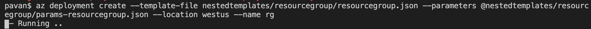
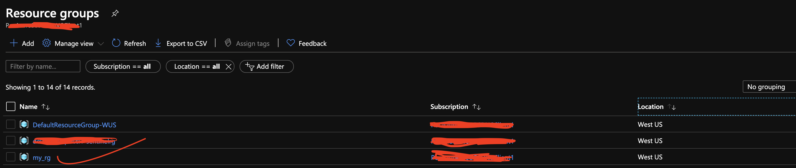

# arm-templates
This Repository contain useful ARM (Azure Resource Manager) Templates 

## Dependencies:

 1. Install [AZ Cli](https://www.youtube.com/watch?v=FdsDtfo8xQY)
 2. Azure account with active subscription.

We are using `az cli` to deploy `arm templates`. Please follow below steps.

```
1. Login with `az login`
2. az account show (shows your subscriptions you have access to)
3. az account set -s <subscriptionId> (sets the subscription to run the commands)
4. az account show (confirms you the active subscription the commands would run on)
```

Resourse group has to be created at the scope of subsriptions. It would reque `az deployment` instead of `az group deplyment`

### Create Resource Group

```
az deployment validate --template-file nestedtemplates/resourcegroup/resourcegroup.json --parameters @nestedtemplates/resourcegroup/params-resourcegroup.json --location westus

(above command throws you a json if the template is valid)

az deployment create --template-file nestedtemplates/resourcegroup/resourcegroup.json --parameters @nestedtemplates/resourcegroup/params-resourcegroup.json --location westus
```



Upon successful creation you should see __Resource Group__ in the azure portal as below.




### Create VNet


Validate ARM template with azure cli

`az group deployment validate --template-file nestedtemplates/vnet/vnet.json --parameters @nestedtemplates/vnet/params-vnet.json --resource-group my_rg | jq`

(Above command should return a json file, __remove__ `| jq` at the end of the command if you don't `jq` already installed on your machine.)


`az group deployment create --template-file nestedtemplates/vnet/vnet.json --parameters @nestedtemplates/vnet/params-vnet.json --resource-group my_rg | jq`

[vnet-create-running.png](docs/images/vnet-create-running.png)

master json validate and create

```az group deployment validate --template-file master.json --resource-group my-rg | jq
az group deployment create --template-file master.json --resource-group my-rg | jq

